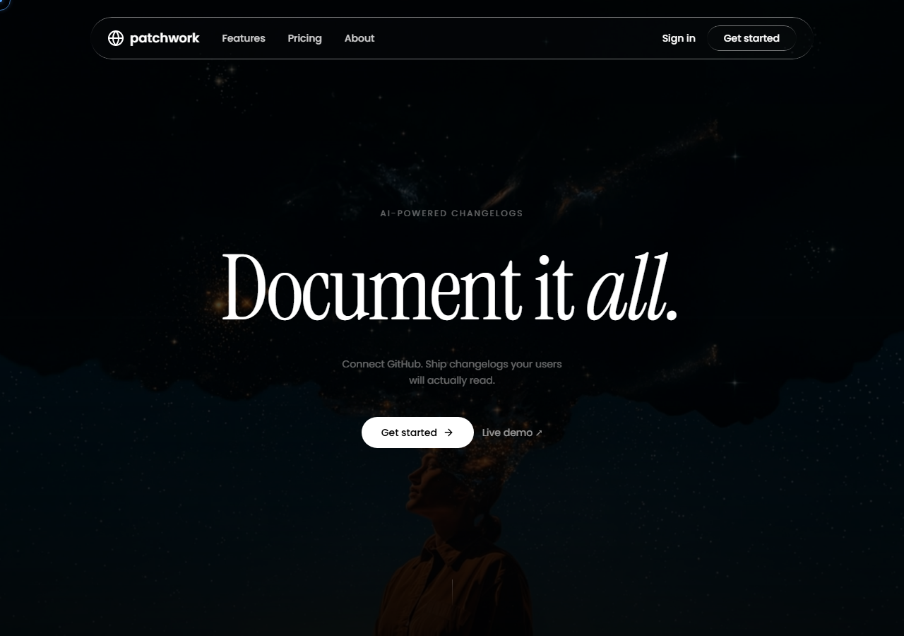
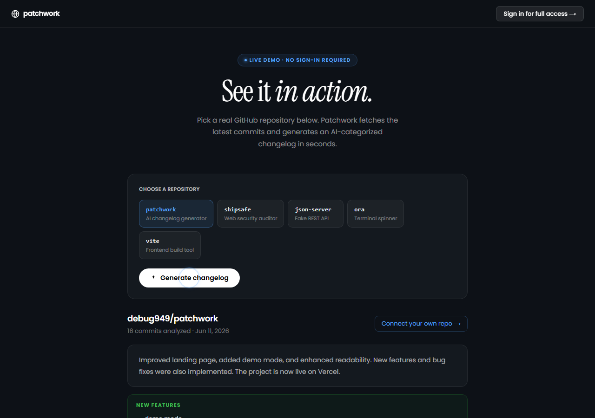
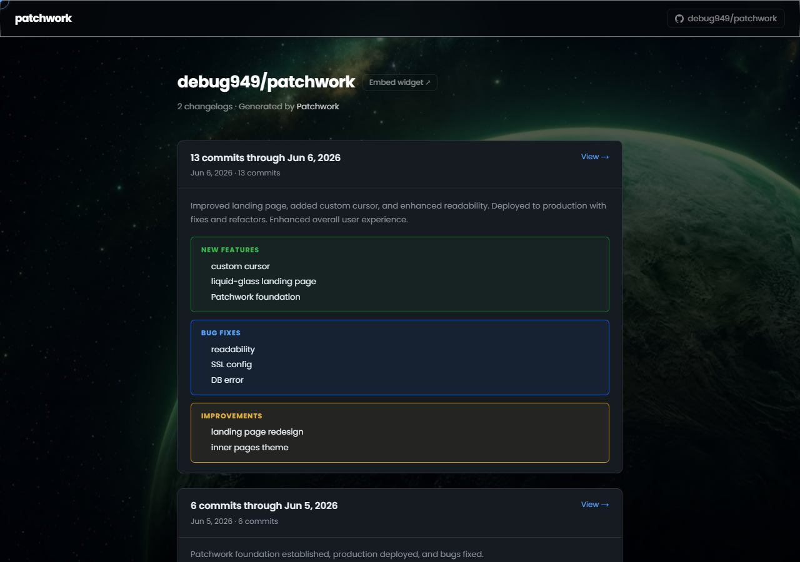
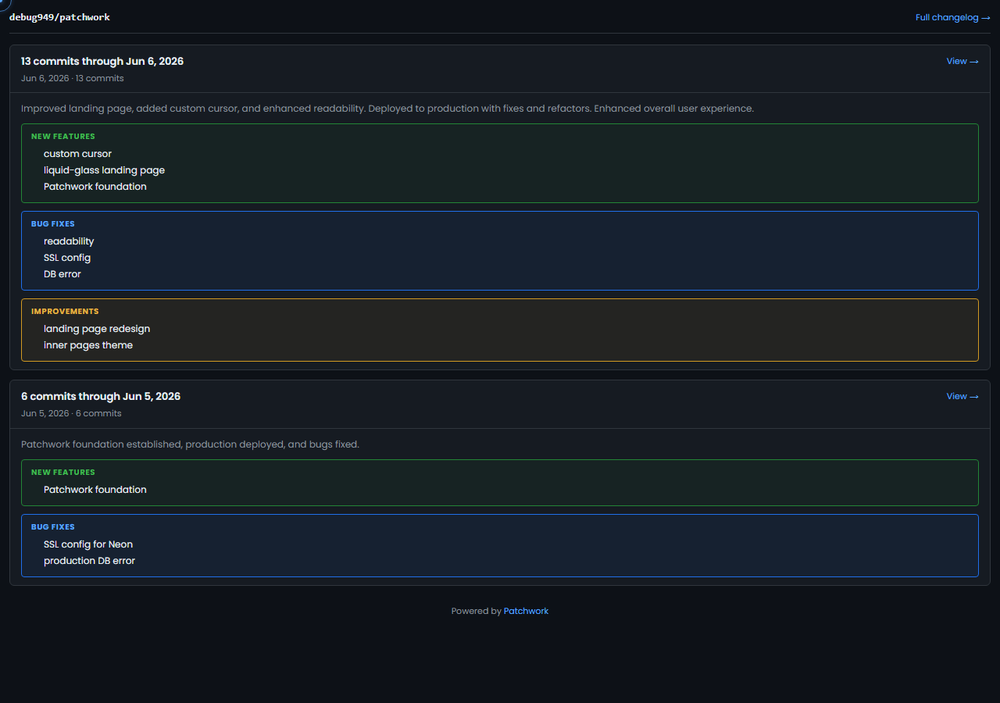
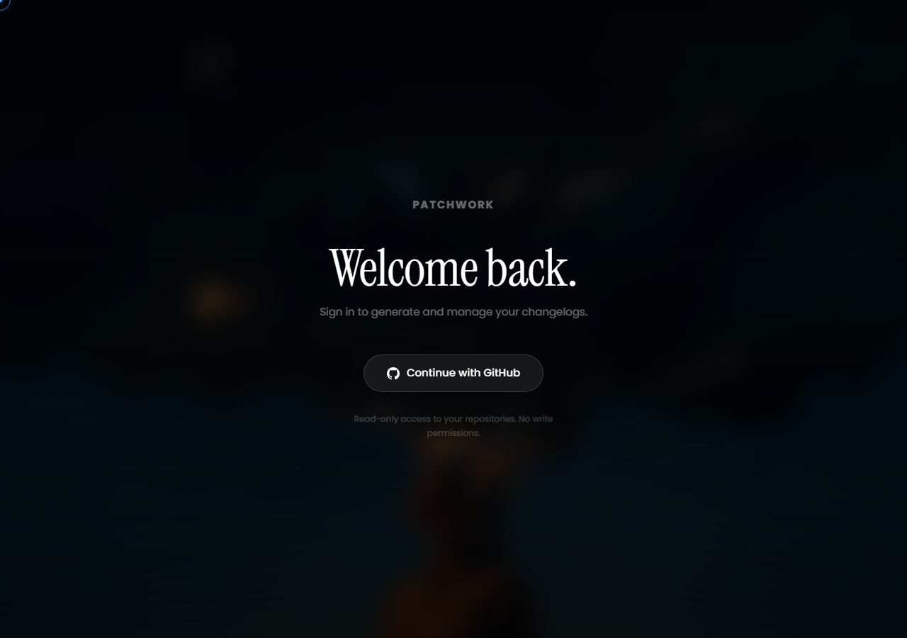

# Patchwork — AI Changelog Generator

> Turn commit history into readable changelogs. One click.

Auto-generate AI-powered changelogs from GitHub commit history — shareable public pages, an embeddable `<iframe>` widget, and a public JSON API, all behind a single GitHub OAuth sign-in.

**Live:** [patchwork-vihan.vercel.app](https://patchwork-vihan.vercel.app) &nbsp;·&nbsp; **Demo:** [patchwork-vihan.vercel.app/demo](https://patchwork-vihan.vercel.app/demo) &nbsp;·&nbsp; **GitHub:** [debug949/patchwork](https://github.com/debug949/patchwork)

<p>
  
  
  
  
  
  
  
</p>

---

## Screenshots

### Landing


### Live Demo — AI result


### Public Changelog Page


### Embeddable Widget


### Sign-in


---

## Features

| Feature | Description |
|---------|-------------|
| **GitHub OAuth** | Raw OAuth 2.0 — no NextAuth, CSRF-protected with state param |
| **Tag range generation** | Select `from` and `to` git tags — generates changelog from the exact commit range |
| **AI categorization** | Groq (llama-3.3-70b) sorts commits into features, fixes, refactors, breaking changes |
| **Public changelog pages** | Every repo gets `/log/owner/repo` — no login required to view |
| **Embeddable widget** | One `<iframe>` tag, copy button included |
| **Public JSON API** | `/api/public/owner/repo` with CORS headers for custom integrations |
| **Live demo** | `/demo` — try the full flow without signing in |
| **Multi-tenant data model** | Cascade-delete isolation per user |

---

## Tech Stack

| Layer | Technology |
|-------|-----------|
| Framework | Next.js 16 (App Router) + TypeScript |
| Styling | Tailwind CSS v4 + custom liquid-glass CSS |
| Database | Prisma 7 + PostgreSQL (Neon) |
| Auth | Raw GitHub OAuth 2.0 + iron-session (encrypted cookies) |
| AI | Groq API — llama-3.3-70b-versatile (falls back to keyword classifier) |
| Deploy | Vercel (Edge-compatible) |

---

## Architecture

```
/src
  /app
    /api
      /auth/github      ← OAuth initiation (builds redirect_uri)
      /auth/callback    ← Token exchange + session creation
      /repos            ← CRUD for connected repositories
      /repos/[id]/generate  ← Commit fetch + AI generation + DB write
      /repos/[id]/tags      ← Fetch GitHub tags for range selection
      /demo/generate        ← Public demo endpoint (no auth, preset repos)
      /public/[owner]/[repo] ← Public JSON API (CORS open)
    /dashboard          ← Authenticated repo list
    /repos/[id]         ← Repo detail + generate form + embed snippet
    /log/[owner]/[repo] ← Public changelog page
    /demo               ← No-auth demo (any of 5 preset repos)
  /components
    GenerateForm        ← Two-mode form: recent commits OR tag range
    CopyEmbedButton     ← Client-side clipboard copy with visual feedback
    DemoClient          ← Interactive demo with repo selector + live results
    CustomCursor        ← Canonical cursor engine (dot + ring, lerp 0.11)
  /lib
    github.ts           ← GitHub API: commits, tags, compare API, public fetch
    ai.ts               ← Groq + mock fallback changelog generator
    session.ts          ← iron-session helpers
    db.ts               ← Prisma client singleton
```

---

## Getting Started

### 1. Clone & install

```bash
git clone https://github.com/debug949/patchwork
cd patchwork
npm install
```

### 2. Create a GitHub OAuth App

1. Go to [github.com/settings/developers](https://github.com/settings/developers)
2. **New OAuth App**
3. Homepage URL: `http://localhost:3000`
4. Callback URL: `http://localhost:3000/api/auth/callback`
5. Copy **Client ID** + **Client Secret**

### 3. Environment variables

```bash
cp .env.example .env.local
```

```env
DATABASE_URL="postgresql://..."         # Neon or local Postgres
GITHUB_CLIENT_ID="Ov23li..."
GITHUB_CLIENT_SECRET="..."
SESSION_SECRET="64-hex-chars"           # node -e "console.log(require('crypto').randomBytes(32).toString('hex'))"
GROQ_API_KEY="gsk_..."                  # optional — falls back to keyword matching
NEXT_PUBLIC_APP_URL="http://localhost:3000"
```

### 4. Database

```bash
npx prisma migrate dev --name init
```

### 5. Run

```bash
npm run dev
```

Visit [http://localhost:3000](http://localhost:3000).

---

## Deployment (Vercel)

1. Push to GitHub
2. Import in [Vercel](https://vercel.com)
3. Add all env vars from `.env.example`
4. Update GitHub OAuth App callback URL → `https://your-domain.vercel.app/api/auth/callback`
5. Set `NEXT_PUBLIC_APP_URL` = `https://your-domain.vercel.app`

> **Important:** When setting `NEXT_PUBLIC_APP_URL` via Vercel CLI, use `printf` not `echo` to avoid BOM injection:
> ```bash
> printf 'https://your-domain.vercel.app' | vercel env add NEXT_PUBLIC_APP_URL production
> ```

---

## Generating Changelogs

### Recent commits mode
Fetches the latest N commits (default 50). Optionally filter by date and set a version label.

### Tag range mode
Select a **from** tag and **to** tag. Patchwork calls the GitHub Compare API (`/compare/v1.0.0...v1.1.0`) to get the exact commits in that range, then generates a categorized changelog. The **to** tag is auto-used as the version label.

---

## Embed Widget

```html
<iframe
  src="https://patchwork-vihan.vercel.app/embed/owner/repo"
  width="100%"
  height="600"
  frameborder="0"
></iframe>
```

The embed snippet is available in-app with a one-click copy button on each repository page.

---

## Public JSON API

```
GET /api/public/:owner/:repo
```

Response:
```json
{
  "repository": { "fullName": "owner/repo", "description": "..." },
  "changelogs": [
    {
      "title": "v1.2.0 — Jun 5, 2026",
      "version": "v1.2.0",
      "commitCount": 23,
      "content": {
        "summary": "This release includes 5 new features and 3 bug fixes.",
        "features": ["Add tag range selection for changelog generation"],
        "fixes": ["Fix BOM in OAuth redirect URI"],
        "refactors": ["Unify cursor engine across all projects"],
        "breaking": []
      }
    }
  ]
}
```

---

## Challenges Solved

**1. Raw GitHub OAuth 2.0 without a library.** Rather than delegating to NextAuth, Patchwork implements the full OAuth 2.0 authorization code flow: CSRF-protected state param generation, token exchange POST with client credentials, session encryption via `iron-session`. No magic — every step is explicit and auditable.

**2. Groq structured output with keyword fallback.** The AI layer requests a strict JSON object (features/fixes/refactors/breaking). When Groq is unavailable or the API key is absent, a deterministic keyword classifier on commit messages produces the same shape — so the product degrades gracefully rather than breaking.

**3. Tag range via GitHub Compare API.** Fetching commits between two arbitrary git tags requires `GET /repos/:owner/:repo/compare/:base...:head`, which returns commits in the range (not just the tag refs). Patchwork wraps this into a tag-range mode distinct from the recency-based mode, with the `to` tag auto-populated as the version label.

**4. Multi-tenant cascade delete.** Each user owns repositories, which own changelogs. Prisma schema enforces cascade deletes at the database level so removing a user (or a connected repo) atomically removes all dependent records — no orphan cleanup logic needed.

**5. Embed widget without a second deployment.** The embeddable iframe uses a dedicated `/embed/:owner/:repo` route that renders a stripped-down changelog view (no nav, no auth UI) optimised for cross-origin iframes. The embed snippet is generated and copy-able directly from each repo's detail page.

---

## What This Demonstrates

- **OAuth engineering** — raw GitHub OAuth 2.0 flow (CSRF state param, token exchange, encrypted session via `iron-session`) without any auth library, making every security decision explicit.
- **AI integration** — structured JSON output from Groq LLaMA 3.3, strict parsing and validation, and a keyword-classifier fallback so the product works even when the AI key is missing.
- **Multi-tenant data model** — per-user repository and changelog isolation with Prisma cascade deletes, preventing data leakage between users.
- **Public API design** — CORS-enabled JSON endpoint with consistent structure, suitable for external integrations without requiring authentication.
- **Embeddable widget** — cross-origin `<iframe>` route with a stripped render mode, generated embed snippet, and one-click clipboard copy in-app.
- **Production deployment** — live Vercel deployment with Neon PostgreSQL, full environment variable management, and graceful degradation when optional services are absent.

---

## Resume Bullet

> **Patchwork — AI Changelog Generator.** Built and deployed a multi-tenant SaaS tool (Next.js, TypeScript, Prisma, PostgreSQL) that generates AI-categorized changelogs from GitHub commit history. Implemented raw GitHub OAuth 2.0 (no NextAuth) with CSRF protection, Groq LLaMA 3.3 structured output with keyword-classifier fallback, and a public embeddable iframe widget — all behind a single sign-in. Live at patchwork-vihan.vercel.app.

---

## License

MIT
